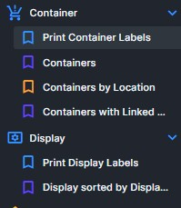
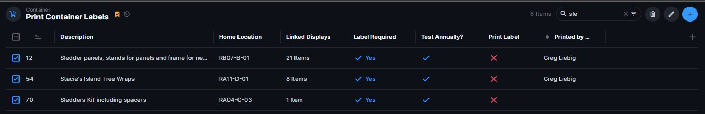
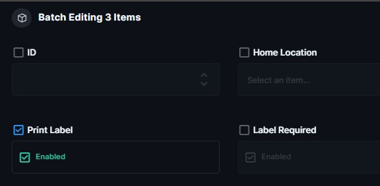

# MSB Label Printing — Operator Guide

**Author:** Greg Liebig / Engineering Innovations, LLC  
**Date:** 2026-03-22  
**System Version:** Label Service v3.x  

This guide explains how to print display and container labels
using the Directus interface.

This is semi-production ready and any suggestions or problems
you may run into, please let Greg know so they can be corrected.

---

## ⚠️ IMPORTANT SAFETY NOTES

### Tape Must Be Installed

The system cannot reliably detect an empty tape cartridge.

Before printing:

✔ Verify tape cartridge is installed  
✔ Verify tape width matches template (1.4")  
✔ Verify printer is powered on and online  

---

## ▶ Starting the Label Print Service (Print Server)

>The label printing system runs on a **dedicated print server machine**.
>Labels will NOT print unless this service is running.

---

### 🖥 Where This Runs

The service runs on the **Label Print Server** (separate machine).

This allows labels to be queued to print from any authenticated device at any time.

---

## ⚠ CRITICAL RULE — READ THIS FIRST

🚫 **DO NOT click "Print" multiple times in Directus**

If nothing prints immediately:

👉 **STOP and check the service first**

The system runs on a polling cycle and may take a few seconds to respond.

Repeated clicks will create **duplicate batches** and waste label tape.

---

## ▶ When You Should Start the Service

Only start the service if:

✔ Labels are not printing  
✔ The Blue service window is NOT open or in the task bar.

If the service is already running → DO NOT restart it

---

## ▶ Start Procedure

1. Go to the **Label Print Server**
2. Log in if needed
3. On the desktop, double-click:

👉 **Start Label Service** icon

---

### 🟦 Expected Result (IMPORTANT)

A window will open with:

✔ Blue background  
✔ Yellow text  
✔ Command-style appearance  

This is the **Label Print Service window**

---

### ✔ Service Ready State

Within a few seconds, you should see:

>Startup health check PASSED.

>Service READY — polling every 15 seconds.

If you see this, the system is ready.

---

## ⛔ IMPORTANT — Do NOT Close This Window

⚠ This window must remain open at all times

🚫 **DO NOT click the X (this will STOP the service)**  
✔ Use the **_ (minimize)** button instead  

If this window is closed:

❌ Label printing will STOP  
❌ The system will NOT recover automatically  

---

## 🌐 Required Browser Tabs

Open Google Chrome and make sure these are available:

- https://my.sheboyganlights.org  
- https://db.sheboyganlights.org  

---

## ✅ How to Confirm the System Is Working

Before reprinting anything, check:

✔ The blue/yellow service window is open  
✔ No error messages are shown  
✔ The system shows polling messages  

---

## ⚠ If Labels Did NOT Print

Follow this EXACT order:

1. **Wait 10–15 seconds**
   - The system may still be processing

2. **Check the service window**
   - Not open → Start it
   - Shows errors → STOP and report

3. **ONLY AFTER VERIFYING ABOVE**
   - Retry the print ONCE

🚫 Do NOT repeatedly click print

---

## ⏹ Stopping the Label Print Service (Only If Directed)

1. Click the blue service window  
2. Press:

>Ctrl + C

---

## 🚨 If There Is a Problem

If the service is running and printing still fails:

👉 Contact Greg

Do NOT continue retrying

## 🖥️ Accessing Label Printing

Use the Directus left navigation panel.

### Display Labels

Display → Print Display Labels

### Container Labels

Container → Print Container Labels

---

## 📋 Printing Multiple Labels at Once

### Step 1 — Find the Items

Use the search box at the top of the table.

Example:

- Type part of a container name
- Filter by location
- Narrow the list as needed

---

### Step 2 — Select Items

Use the checkbox column on the left side of the table.

Select all items you want to print.

---

### Step 3 — Open Batch Editor

Click the pencil icon in the upper-right corner.

This opens the batch editing panel.

---

### Step 4 — Enable Print Label

Toggle **Print Label → Enabled**

Then save the changes.

---

## 🖨️ What Happens Next

After saving:

1. Labels are queued automatically
2. The print service creates a batch
3. Labels print at the label printer
4. The Print Label flag resets automatically after completion

No further action is required.

---

## ❗ If Printing Does Not Start

Check the following:

- Printer power
- Network connection
- Tape installed
- Correct tape width
- Printer not paused or offline

If problems persist, notify system administrator.

---

## ❗ If Tape Runs Out During Printing

Symptoms:

- Printer stops feeding tape
- Labels may be incomplete
- System may still mark batch complete

Action:

Note: This section is not tested as of 3/22/26-GAL

1. Load a new cartridge
2. Re-select labels that did not print
3. Enable **Print Label** again
4. Save to reprint

---

## 📦 Container Labels vs Display Labels

### Display Labels

- One label per display
- Typically printed in batches

### Container Labels

- Two labels printed per container
- Used for physical storage identification

---

## 📌 Best Practices

✔ Print labels in manageable batches  
✔ Verify output before removing items  
✔ Keep spare cartridges nearby  
✔ Do not power off printer during printing  

---

## 🆘 Support

Contact the MSB production database administrator
if printing repeatedly fails or produces incorrect labels.

---

## 🔄 Revision History

- Initial operator guide for Label Service v3